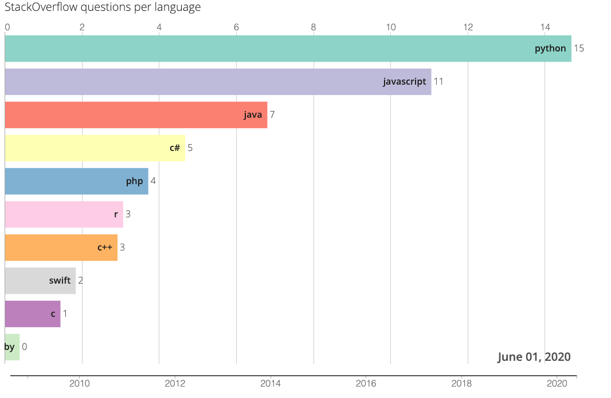

# barchartrace
**Online bar chart race generator** :
[https://fabdevgit.github.io/barchartrace/](https://fabdevgit.github.io/barchartrace/)

## Accepted csv formats
input data should be in a csv file.
Dates should be 'YYYY'

Option 1 : one row per date (ordered) and one column per contender.

Date | Name1 | Name2
--- | --- | ---
2018 | 1 | 1
2018 | 2 | 3
2018 | 4 | 7

Option 2 : one row per contender and per date (row order doesn't matter)

Date | Name | Value
--- | --- | ---
2018 | Name1 | 1
2018 | Name2 | 3
2018 | Name1 | 2
2018 | Name2 | 3
2018 | Name1 | 4
2018 | Name2 | 7

## Screenshot

